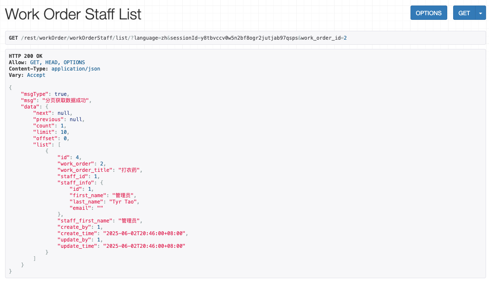

这是一个工单系统，均通过Python进行编写，Python的版本为3.12.3.
本项目是开源项目，欢迎下载试用

由于众所周知的原因，pip下载比较慢,可用国内镜像，如下所示
pip install -i https://pypi.tuna.tsinghua.edu.cn/simple django-filter

如何生成语言包
python3 manage.py makemessages -l zh_Hans  # 或者 -l zh_CN，本代码表示生成简体中文语言包

如何编译语言包
python3 manage.py compilemessages  -i "venv"，其中，-i "venv"表示仅仅压缩本虚拟目录中

Rest访问地址：
    如下访问地址中，浏览器中get数据时需要增加参数format=json,实际使用过程中不需要该参数
    分页空间采用CustomLimitOffsetPagination

    登陆授权
        http://localhost:8080/rest/auth/login?username=admin&password=admin&language=en
        本代码中三个参数，分别表示用户名、密码与语言（英语），如果不指定返回语言，则采用中文

    获取数据字典类型
        列表：http://localhost:8080/rest/system/dictType/list/?format=json&language=zh&sessionId=y8tbvccv0w5n2bf8ogr2jutjab97qsps&limit=1&offset=0

        获取、更新、删除:http://localhost:8080/rest/system/dictType/5/?language=zh&sessionId=y8tbvccv0w5n2bf8ogr2jutjab97qsps

    获取数据字典类型数据
        列表:http://localhost:8080/rest/system/dictData/list/?format=json&language=zh&sessionId=y8tbvccv0w5n2bf8ogr2jutjab97qsps&dict_type_id=6&limit=1&offset=0

        获取、更新、删除:http://localhost:8080/rest/system/dictData/1/?language=zh&sessionId=y8tbvccv0w5n2bf8ogr2jutjab97qsps

    获取工单
        列表:http://localhost:8080/rest/workOrder/workOrder/list/?format=json&language=zh&sessionId=y8tbvccv0w5n2bf8ogr2jutjab97qsps&start_date__gte=2025-06-01&start_date__lte=2025-06-09&limit=1&offset=0
            其中指定了开始时间范围，更多查询参数请参看文档work_order/views.py中WorkOrderViewSet部分

        
    获取工单执行人：
        根据工单标识获取列表：http://localhost:8080/rest/workOrder/workOrderStaff/list/?format=json&language=zh&sessionId=y8tbvccv0w5n2bf8ogr2jutjab97qsps&work_order_id=2
