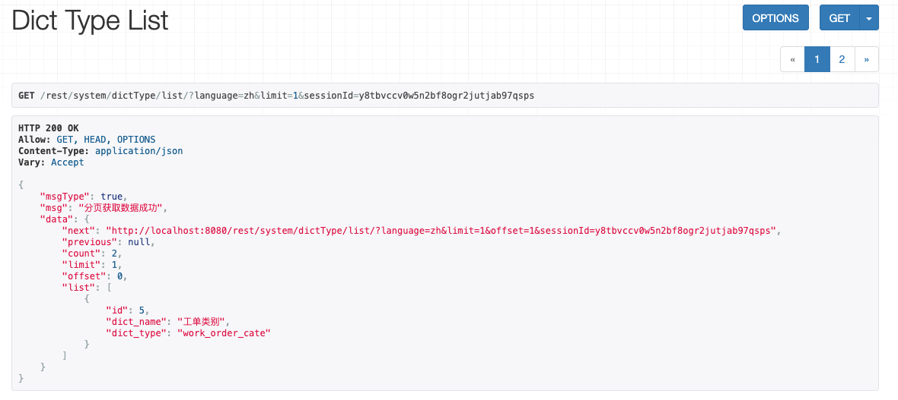
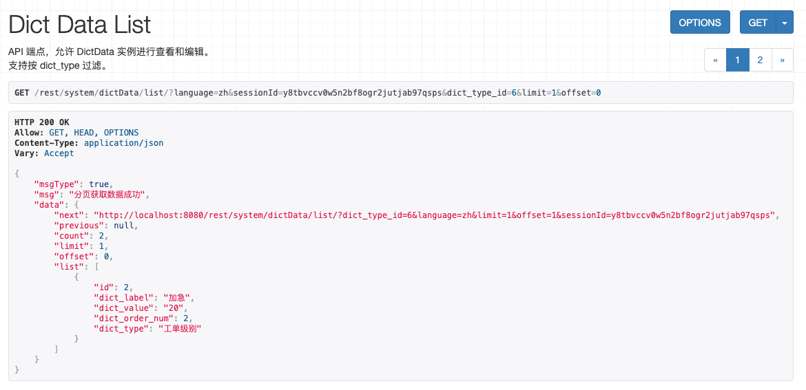
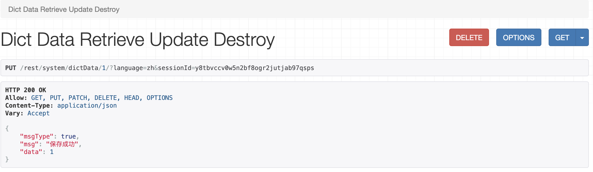
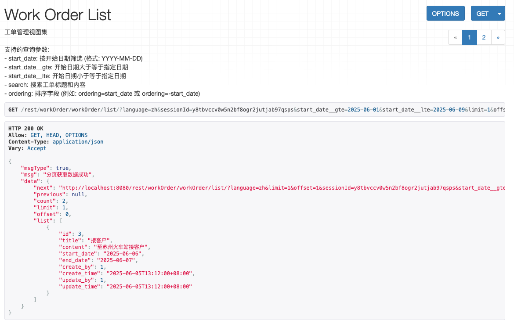

# 项目简介

这是一个工单系统,是作者接触Python后的第一个开源项目。项目的英文全称为Work Order System,英文取首字母WOS。

## 开发语言与协议
均通过Python进行编写，Python的版本为3.12.3.
本项目完全开源，准巡最宽松开源协议。本部分实现Web与Rest接口两部分，Android移动端遵循请参看另外一个开源项目wos_mobile

由于众所周知的原因，pip下载比较慢,可用国内镜像，如下所示
pip install -i https://pypi.tuna.tsinghua.edu.cn/simple django-filter

### 语言包

#### 生成:# -l zh_CN，本代码表示生成简体中文语言包
```bash
python3 manage.py makemessages -l zh_Hans  
```
#### 编译:参数，-i "venv"表示仅仅压缩本虚拟目录中的语言包
```bash
python3 manage.py compilemessages  -i "venv"
``` 

## Rest访问地址：
    注意事项：
        访问地址中，浏览器中get数据时需要增加参数format=json,实际使用过程中不需要该参数
        改写了get返回数据格式，如果需要通过Web方式进行联调，注释core.BasicRetrieveUpdateDestroyAPIView.retrieve
        language参数支持中英文两种，默认是中文，英文为en,中文为zh
        登陆令牌为调用登陆后的令牌，请根据实际调用结果替换

## 效果演示:

### 登陆授权
```bash
http://localhost:8080/rest/auth/login?username=admin&password=admin&language=en
``` 
#### 本代码中三个参数，分别表示用户名、密码与语言（英语），如果不指定返回语言，则采用中文


### 获取登陆授权
```bash
http://localhost:8080/rest/system/mobileAccess/permission/?language=zh&sessionId=y8tbvccv0w5n2bf8ogr2jutjab97qsps
```


### 数据字典
#### 类型列表
```bash
http://localhost:8080/rest/system/dictType/list/?language=zh&limit=1&sessionId=y8tbvccv0w5n2bf8ogr2jutjab97qsps
``` 


#### 创建
```bash
http://localhost:8080/rest/system/dictType/?language=zh&sessionId=y8tbvccv0w5n2bf8ogr2jutjab97qsps
``` 


#### 获取、更新、删除
```bash
http://localhost:8080/rest/system/dictType/5/?language=zh&sessionId=y8tbvccv0w5n2bf8ogr2jutjab97qsps
``` 


##### 注意：如下效果是注释core.BasicRetrieveUpdateDestroyAPIView.retrieve以后的结果


#### 类型数据列表
```bash
http://localhost:8080/rest/system/dictData/list/?language=zh&sessionId=y8tbvccv0w5n2bf8ogr2jutjab97qsps&dict_type_code=work_order_cate&limit=10&offset=0
``` 
    其中，dict_type_code为上级数据数据类型DictType中的dict_type


#### 创建
```bash
http://localhost:8080/rest/system/dictData/?language=zh&sessionId=y8tbvccv0w5n2bf8ogr2jutjab97qsps&dict_type_code=work_order_cate
``` 
##### 本接口界面与DictType 创建功能类似，无图

#### 获取、更新、删除
```bash
http://localhost:8080/rest/system/dictData/1/?language=zh&sessionId=y8tbvccv0w5n2bf8ogr2jutjab97qsps
``` 



### 工单
#### 列表
```bash
http://localhost:8080/rest/workOrder/workOrder/list/?format=json&language=zh&sessionId=y8tbvccv0w5n2bf8ogr2jutjab97qsps&start_time__gte=2025-06-01&start_time__lte=2025-12-09&limit=10&offset=0
``` 
    其中指定了开始时间范围，更多查询参数请参看文档work_order/views.py中WorkOrderViewSet部分


#### 增加工单
```bash
http://localhost:8080/rest/workOrder/workOrder/?language=en&sessionId=y8tbvccv0w5n2bf8ogr2jutjab97qsps
```


#### 获取、更新、删除
```bash
http://localhost:8080/rest/workOrder/workOrder/3/?language=zh&sessionId=y8tbvccv0w5n2bf8ogr2jutjab97qsps
``` 


### 工单执行人
#### 工单执行人列表,根据工单标识获取列表：
```bash
http://localhost:8080/rest/workOrder/workOrderStaff/list/?format=json&language=zh&sessionId=y8tbvccv0w5n2bf8ogr2jutjab97qsps&work_order_id=2
```


#### 工单派工
```bash
http://localhost:8080/rest/workOrder/workOrderStaff/?language=zh&sessionId=y8tbvccv0w5n2bf8ogr2jutjab97qsps
```


#### 获取、更新、删除
```bash
http://localhost:8080/rest/workOrder/workOrderStaff/4/?language=zh&sessionId=y8tbvccv0w5n2bf8ogr2jutjab97qsps
```
